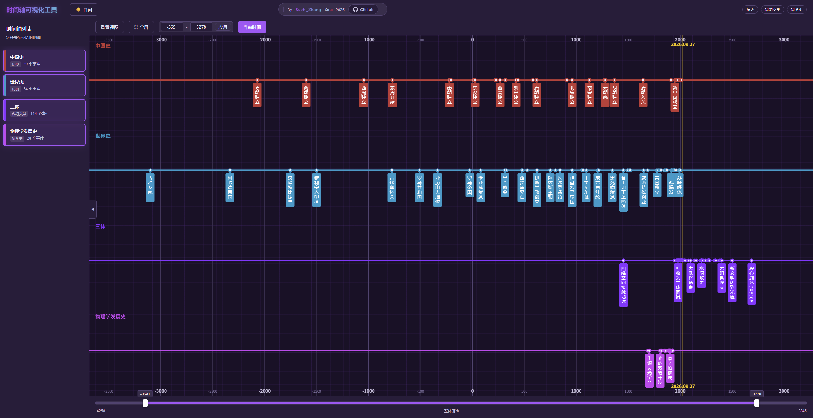

**时间轴可视化工具（Timeline Visualizer）** 是一个轻量级的交互式多时间轴可视化工具。它可以将**不同主题的事件排列在共享时间坐标的平行轨道上，帮助使用者观察事件的先后、同时性与时间跨度**，理解历史、科学发展和文学叙事之间的时间关系。

你可以并排查看中国史与世界史，也可以把科学发展史、文学作品中的事件与历史背景放在一起对照。通过缩放和拖动，从跨越数千年的整体视图深入到具体事件。

项目使用原生 JavaScript、HTML 和 CSS，无需构建流程或后端服务。



# 页面功能

- **多时间轴对照**：各轨道共享横向时间坐标，以不同颜色区分主题；点击侧栏可自由组合显示。
- **缩放与平移**：鼠标滚轮围绕指针位置缩放，按住左键拖动平移；支持移动端单指平移、双指缩放与平移。拖动底部左右滑块调整范围，拖动中间选区整体平移；
- **事件阅读**：标签根据重要度和间距自动取舍；悬停查看摘要，点击打开详情，支持上一事件、下一事件导航。
- **显示控制**：重置视图、收起侧栏、切换日夜模式、显示或隐藏当前时间刻度、切换全屏。
- **临时编辑**：右键点击侧栏时间轴，可编辑标题、分类、颜色与事件 JSON，或删除该时间轴；移动端可长按打开菜单。编辑和删除仅作用于当前页面，刷新后恢复文件中的数据。需要长期保存的修改，请更新项目中的 JSON 文件和时间轴索引。

# 本地运行

**在项目根目录启动静态 HTTP 服务。**也可以使用已有的 `http-server` 或其他静态服务器，无需安装前端依赖或执行构建。不能直接双击 `index.html` 用 `file://` 打开。

移动端建议横屏使用。全屏和横屏锁定取决于浏览器支持；如果无法锁定，可手动旋转设备。

**注：强烈不建议使用夸克浏览器。**夸克浏览器由于其内置双指操作与本项目缩放操作冲突，因此使用体验极差。

# 操作说明

| 操作 | 方式 |
|---|---|
| 显示或隐藏时间轴 | 点击侧栏中的时间轴 |
| 按分类查看 | 点击顶部“历史”“科幻文学”等分类 |
| 缩放 | 在时间轴绘图区滚动鼠标滚轮，或使用双指手势 |
| 平移 | 在绘图区拖动，或拖动底部选区 |
| 指定时间范围 | 输入起始和结束年份，点击“应用”或按回车；负年份代表公元前 |
| 查看事件 | 悬停标签查看摘要，点击标签打开详情 |
| 浏览相邻事件 | 点击详情中的上一/下一事件，或使用左右方向键；顺序取自该时间轴的数据数组 |
| 恢复整体视图 | 点击“重置视图”，按当前选中的时间轴重新计算范围 |
| 编辑或删除 | 在侧栏时间轴上右键，移动端长按 |

常规缩放有最小视图跨度。标签拥挤时，放大视图可以看到更多标签；标签的显示和隐藏受重要度影响，重要度更高的事件会优先显示。

# 添加时间轴数据

新增时间轴需要修改项目文件：

1. 在 `TL_Data/` 中创建 JSON 文件，内容为事件对象数组。
2. 在 `index.js` 的 `TIMELINE_INDEX` 数组中追加配置：

   ```javascript
   {
       id: 'my-timeline',
       title: '我的时间轴',
       color: '#f59e0b',
       eventPath: './TL_Data/TL_MyTimeline.json',
       category: '自定义分类'
   }
   ```

3. 刷新页面，在侧栏中选择新时间轴。如需默认显示，将其 `id` 加入 `defaultTimelineIds` 数组。

`id` 应保持唯一，事件按时间先后排列。空时间轴加载时跳过，并通过 Toast 和控制台报错。同一时间轴内定位日期相同的事件仅在控制台警告，需作者修正数据。

## CSV 数据准备工具

为方便时间轴的编辑，在`CSV/` 提供 Windows 下的 **CSV 转 JSON 脚本**，以及 CSV 示例和 Excel 编辑文件。可以直接在Excel写事件，存为CSV文件，并使用CSV文件生成对应的JSON。

CSV 表头为：

```text
Year,Month,Day,Title,Label,Importance,Desc,Detail,Era
```

将 CSV 拖到 `CSV/0_CSVToJson.bat`，或运行：

```powershell
.\CSV\0_CSVToJson.ps1 -InputFile ".\CSV\MyData.csv"
```

脚本会读取 UTF-8 CSV，将结果复制到剪贴板，并提供显示或保存 JSON 文件的选项。保存后，将文件放入 `TL_Data/` 并注册到 `index.js`。单条记录的转换结果可能是对象，使用前请确保外层为数组 `[...]`。

# JSON 数据规范

每个数据文件使用数组形式，数组中的每一项代表一个事件：

| 字段 | 类型 | 必填 | 说明 |
|---|---|---|---|
| `year` | Number | 是 | 年份，负数表示公元前，如 `-200` |
| `month` | Number | 否 | 月份，绝对值为 1–12；负号控制隐藏，定位规则不变 |
| `day` | Number | 否 | 日期，绝对值为该月有效日数；负号控制隐藏，定位规则不变 |
| `title` | String | 是 | 事件完整标题，用于详情显示 |
| `label` | String | 否 | 时间轴上的短标签，留空时使用 `title` |
| `importance` | Number | 否 | 建议为 0–7，数值越大，标签显示优先级越高；默认 0 |
| `desc` | String | 否 | 事件简介，用于摘要和详情 |
| `detail` | String | 否 | 详细内容，使用 `\n` 换行；详情按段落展示纯文本 |
| `era` | String | 否 | 纪元或时期说明，例如“黄金时代”；不同于时间轴的 `category` 分类 |

月、日未知时可省略，也兼容 `null` 或空字符串。建议年份及已填写的月、日使用数字。未提供月份时，日期不参与定位或显示。

加载和编辑共用数据校验：检查数组、必填字段及数字格式；暂不检查月日有效范围。文字长度和重要度范围是编写建议，不是程序限制。

**原则：一切以最终显示效果为准，规范与效果冲突时优先效果。**

## 日期定位与负号

**月日的绝对值决定位置，负号只控制显示。** 同一年内事件时间不明时，可用负月日调整排列位置。

- 月份为正、日期为正：显示年、月、日。
- 月份为正、日期为负或未填写：只显示年、月。
- 月份为负或未填写：只显示年份，不单独显示日期。
- 年份的负号仍表示公元前，不用于隐藏年份。

| 数据 | 卡片日期 | 定位 |
|---|---|---|
| `year: 2007, month: 6, day: 15` | `2007.06.15` | 2007 年 6 月 15 日的位置 |
| `year: 2007, month: 6, day: -15` | `2007.06` | 与上一行相同 |
| `year: 2007, month: -6, day: 15` | `2007` | 与上一行相同 |
| `year: 2007, month: -6, day: -15` | `2007` | 与上一行相同 |

每个月占 `1/12` 年。例如 `month: 6` 和 `month: -6` 都定位于 `2007 + 5/12 ≈ 2007.4167`。

当事件的确切月日未知、但需要调整同一年内的排列位置时，可以填写负月日；这些值只作为排版位置，不应被理解为已知的真实日期。

**原则：偏移幅度根据事件顺序或重要程度调整，以各缩放层级显示清晰为目标**

## 重要度（Importance）

缩放时标签的显示会根据重要度和间距自动取舍；

| 建议等级 | 用途 |
|---|---|
| 7 | 里程碑事件，优先争取标签空间 |
| 5 | 重要事件 |
| 3 | 值得重点关注的事件 |
| 1 | 比相邻普通事件略优先 |
| 0 | 普通事件，默认值 |

**建议：**半数左右事件应为 0，少数为 5-7，拉开差距。可 ±1 微调以优化显示。

## 文本长度

**原则：一切以最终显示效果为准，规范与效果冲突时优先效果。**

- **title** ≤17 字，确保详情面板不换行；
- **label** ≤8 字，title 超8字时必须提供（英文数字两个算1字，空格不算）；
- **desc** 25 字左右，若 title 已足够清晰可留空；

## 示例

```json
[
  {
    "year": 1979,
    "month": 10,
    "day": 21,
    "title": "叶文洁收到三体回复",
    "label": "叶收到三体回复",
    "importance": 7,
    "desc": "叶文洁收到三体世界的警告信息，并回复",
    "detail": "第一段详细说明。\n第二段详细说明。",
    "era": "黄金时代"
  },
  {
    "year": 2007,
    "month": -6,
    "day": -15,
    "title": "示例事件",
    "label": "示例",
    "importance": 0,
    "desc": "月日仅用于安排位置，日期只显示年份",
    "detail": "根据实际事件填写详细内容。",
    "era": ""
  }
]
```

事件内容请使用纯文本和可信数据。当前部分卡片与列表采用 HTML 拼接，尚未统一处理所有输入字段。

# 项目结构与实现

```text
Timeline/
├── index.html       # 页面结构、工具栏与对话框
├── index.js         # 时间轴索引与默认选择
├── TimelineCore.js  # 数据模型、工具函数、日期规则与数据处理
├── Timeline.js      # 应用状态、渲染与交互
├── style.css        # 主题、布局、动画与移动端样式
├── TL_Data/         # 时间轴事件 JSON
├── CSV/             # 数据编辑文件与转换脚本
├── tests/           # Core 与初始化回归测试
├── TODO.txt         # 待办事项
├── Readme.md
├── AGENTS.md        # 开发协作说明
└── LICENSE
```

页面启动后，根据索引加载 JSON。Canvas 绘制共享刻度、轨道与事件圆点；覆盖其上的 DOM 元素负责标签、摘要和点击交互。可见事件卡片通过 Map 缓存复用，标签按重要度和像素间距选择显示。

启动顺序为 `TimelineCore.js` → `Timeline.js` → `index.js`。入口先创建对象，再显式初始化：

```javascript
const app = new TimelineApp();
app.init(TIMELINE_INDEX, defaultTimelineIds).catch(error => {
    console.error('初始化时间轴失败:', error);
    app.showToast('初始化失败，请检查数据和网络后刷新页面');
});
```

在 DOM 就绪后调用 `init()`；重复调用返回同一个任务。全部时间轴并行加载，单条加载、解析、校验失败或为空时跳过，其余照常显示在侧栏。重复 ID 保留索引中首条成功数据。失败原因写入控制台，Toast 汇总提示；全部失败时显示空状态。修正数据或网络问题后刷新重试。

开发验证使用 Node.js 18+：`node --test tests/core.test.js`。后续工作见 [TODO.txt](TODO.txt)。
